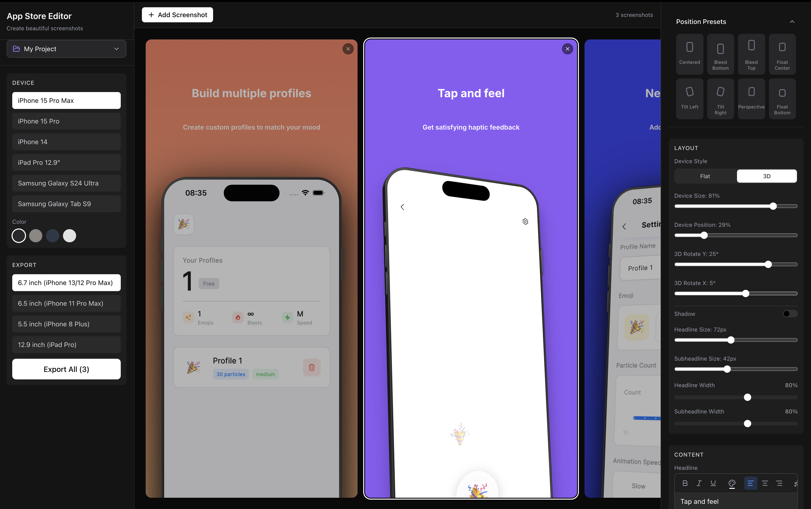

# 📱 App Store Screenshot Generator

A free, open-source tool to create stunning, high-converting screenshots for the Apple App Store and Google Play Store in minutes. Design professional app previews with an intuitive drag-and-drop editor.

🔗 **Live Demo:** [appshots.appstate.xyz](https://appshots.appstate.xyz/)




## ✨ Features

### 📱 Device Frames

- **6 realistic device mockups** — iPhone 15 Pro Max, iPhone 15 Pro, iPhone 14, iPad Pro 12.9", Samsung Galaxy S24 Ultra, Samsung Galaxy Tab S9
- **Multiple color options per device** — Black Titanium, Natural, Blue, White, and more
- **Flat & 3D rendering modes** — toggle between a classic 2D frame and a perspective 3D view with visible device edges
- **3D rotation controls** — adjust Rotate Y and Rotate X angles for the perfect perspective
- **Accurate camera elements** — Dynamic Island, notch, and punch-hole camera matching each device

### 🎨 Backgrounds & Appearance

- **Solid color backgrounds** with a full color picker
- **Gradient presets** — Sunset, Ocean, Mint, Berry, Royal, Rose
- **Screenshot image upload** — drop in your app's actual screenshot
- **Global text color picker**

### 📝 Rich Text & Fonts

- **Rich text editor** for headlines and subheadlines — bold, italic, underline, text color, alignment (left/center/right)
- **Google Fonts integration** — search and preview hundreds of fonts
- **Independent sizing** — separate font size sliders for headline and subheadline
- **Width control** — set how wide each text block spans
- **Drag-to-reposition** — click and drag headlines or subheadlines anywhere on the canvas

### 🖼️ Overlay Images

- **Unlimited overlay images** — upload badges, logos, arrows, or decorations
- **Drag-to-reposition** and **resize** with width percentage control
- **Rotation control** per image
- **Layer management** — place behind or in front of the device, reorder with bring forward/backward/to-front/to-back
- **Per-image shadow** — enable/disable with color, blur, and offset controls

### 📐 Layout & Positioning

- **8 position presets** — Centered, Bleed Bottom, Bleed Top, Float Center, Float Bottom, Tilt Left, Tilt Right, Perspective
- **Device size** slider (scale %)
- **Device vertical position** slider (offset %)
- **Device rotation** (flat mode) or **3D rotation** (3D mode)
- **Device shadow** — toggle on/off with color, blur, and vertical offset controls

### 📋 Project Management

- **Multiple projects** — create, rename, switch between, and delete projects
- **Auto-save** — all projects and settings persist to localStorage across sessions
- **Reset to defaults** — clear everything and start fresh

### 📦 Export

- **Batch export** — export all screenshots at once (ZIP for multiple, PNG for single)
- **4 export size presets** — 6.7" iPhone, 6.5" iPhone, 5.5" iPhone, 12.9" iPad Pro
- **Full 3D support** — 3D perspective, edges, and shadows are preserved in exports
- **Pixel-perfect** — exported images match the on-screen preview

### 🖥️ Editor Experience

- **Multi-screenshot gallery** — add, remove, and navigate screenshots in a horizontal carousel
- **Real-time preview** — all changes update instantly on the canvas
- **Drag-and-drop** — reposition any element by dragging directly on the canvas
- **Element selection** — click to select text or overlay images with visual feedback
- **Dark mode UI** — sleek dark interface that's easy on the eyes

## 🚀 Quick Start

### Prerequisites

- [Bun](https://bun.sh/) (recommended) or Node.js 18+

### Installation

```bash
# Clone the repository
git clone https://github.com/oyeolamilekan/app-screenshot-generator.git
cd app-screenshot-generator

# Install dependencies
bun install

# Start the development server
bun run dev
```

The app will be available at `http://localhost:5173`

### Building for Production

```bash
bun run build
```

The built files will be in the `dist/` directory.

## 🛠️ Tech Stack

- **Framework**: [React 19](https://react.dev/)
- **Routing**: [TanStack Router](https://tanstack.com/router)
- **Styling**: [Tailwind CSS 4](https://tailwindcss.com/)
- **Icons**: [Lucide React](https://lucide.dev/)
- **UI Components**: [shadcn/ui](https://ui.shadcn.com/)
- **Build Tool**: [Vite 7](https://vitejs.dev/)
- **Testing**: [Vitest](https://vitest.dev/)
- **Runtime**: [Bun](https://bun.sh/)

## 📁 Project Structure

```
src/
├── components/
│   ├── CanvasPreview/       # Main canvas, screenshot cards, device container, overlays
│   ├── DeviceFrame/         # Device mockups (flat 2D & 3D with edges)
│   ├── FontPicker/          # Google Fonts search & selection
│   ├── LeftSidebar/         # Device picker, color picker, export controls
│   ├── ProjectSwitcher/     # Project management UI
│   ├── RichTextEditor/      # Rich text formatting toolbar & editor
│   ├── RightSidebar/        # Layout, appearance, content, overlay controls
│   ├── EditorLayout.tsx     # Main editor layout shell
│   └── ui/                  # shadcn/ui components
├── context/
│   └── EditorContext.tsx     # Global editor state & actions
├── lib/
│   ├── export-utils.ts      # Canvas-based screenshot export (flat & 3D)
│   ├── google-fonts.ts      # Google Fonts API loader
│   ├── rich-text-canvas.ts  # Rich text rendering for canvas export
│   └── useLocalStorage.ts   # Persistence hooks
├── routes/
│   ├── __root.tsx           # Root layout
│   └── index.tsx            # Home page
├── types/                   # TypeScript type definitions
├── constants.ts             # Device specs, gradients, export sizes
├── main.tsx                 # Application entry point
└── styles.css               # Global styles
```

## 🎯 Usage

1. **Select a device** — pick from iPhones, iPads, or Samsung devices in the left sidebar
2. **Choose a color** — select a device frame color
3. **Upload a screenshot** — add your app's screenshot to the device screen
4. **Edit text** — click headlines/subheadlines to type, use the rich text toolbar to format
5. **Pick a font** — browse Google Fonts to find the perfect typeface
6. **Set a background** — choose a solid color or gradient preset
7. **Position the device** — use presets or manually adjust size, position, rotation
8. **Switch to 3D** — toggle to 3D mode and adjust perspective angles
9. **Add overlays** — upload badges, logos, or decorations and layer them around the device
10. **Manage screenshots** — add more screenshots to create a complete set
11. **Export** — download all screenshots at App Store resolution

## 🤝 Contributing

Contributions are welcome! Please feel free to submit a Pull Request.

1. Fork the repository
2. Create your feature branch (`git checkout -b feature/amazing-feature`)
3. Commit your changes (`git commit -m 'Add some amazing feature'`)
4. Push to the branch (`git push origin feature/amazing-feature`)
5. Open a Pull Request

### Development Guidelines

- Follow the existing code style
- Write tests for new features
- Update documentation as needed
- Keep commits atomic and well-described

## 📄 License

This project is licensed under the MIT License - see the [LICENSE](LICENSE) file for details.

## 🙏 Acknowledgments

- [TanStack](https://tanstack.com/) for the amazing router and devtools
- [Tailwind CSS](https://tailwindcss.com/) for the utility-first CSS framework
- [Lucide](https://lucide.dev/) for beautiful icons
- [Google Fonts](https://fonts.google.com/) for the font library

## 📬 Contact

- Create an [issue](https://github.com/oyeolamilekan/app-screenshot-generator/issues) for bug reports or feature requests
- Star ⭐ this repo if you find it useful!

---

Made with ❤️ for iOS and Android developers
